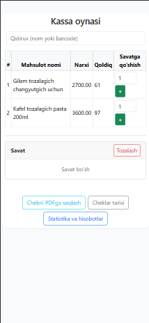
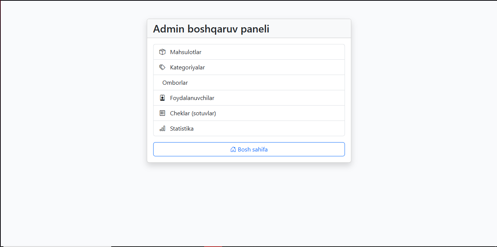

# IdealMarket

**IdealMarket** — bu Django asosidagi zamonaviy, foydalanuvchiga qulay, inventar va sotuvlarni boshqarish (kassa) ilovasi.  
Admin panel va kassa interfeysi Bootstrap bilan 100% responsive, role-based access va soddalashtirilgan CRUD funksiyalari bilan ishlaydi.

---

## 📱 Ekran ko‘rinishlari

| Mobil (Kassa) | Laptop (Admin) |
| --- | --- |
|  |  |

---

## ✨ Asosiy xususiyatlar

- **Mahsulotlar, kategoriyalar va omborlarni boshqarish** (Admin CRUD)
- **Kassir oynasi** (AJAX va Bootstrap asosida savat va to‘lov)
- **Cheklar tarixi va sotuvlar statistikasi** (PDF/Excel eksport)
- **Role-based access** (admin/kassir)
- **Responsive dizayn** (telefon, planshet va laptop uchun)
- **Import/Export** (JSON va Excel)
- **Bootstrap bilan zamonaviy va sodda UI**
- **Foydalanuvchi parolini o‘zgartirish**

---

## 🚀 O‘rnatish (Installation)

1. **Kodni yuklab oling**
    ```bash
    git clone https://github.com/Abdullo200604/idealmarket.git
    cd idealmarket
    ```

2. **Virtual environment yarating (tavsiya etiladi)**
    ```bash
    python -m venv .venv
    source .venv/bin/activate  # Windows: .venv\Scripts\activate
    ```

3. **Talablarni o‘rnating**
    ```bash
    pip install -r requirements.txt
    # yoki alohida
    pip install django django-import-export reportlab pandas
    ```

4. **Database (ma’lumotlar bazasi)ni sozlash**
    ```bash
    python manage.py migrate
    python manage.py createsuperuser
    ```

5. **Serverni ishga tushiring**
    ```bash
    python manage.py runserver
    ```

6. **Saytga kiring:**
    - Home page: [http://localhost:8000/](http://localhost:8000/)
    - Admin panel: [http://localhost:8000/admin/](http://localhost:8000/admin/)

---

## 🧑‍💻 Rol va kirish (Access)

- **Admin** — mahsulotlar, kategoriyalar, ombor, foydalanuvchilar, sotuvlar va statistikani boshqaradi.
- **Kassir** — faqat kassa, savat, chek va umumiy statistikani ko‘radi.

---

## ⚡️ Asosiy imkoniyatlar va qisqa texnik info

- **Kassa:** AJAX, Bootstrap, kartochkada mahsulotlar, savatni boshqarish, chekni rasmiylashtirish, PDF eksport.
- **Mahsulot boshqaruvi:** Jadval, filtr, mahsulot CRUD, import/export, bulk delete.
- **Statistika:** Eng ko‘p sotilgan mahsulot/kategoriya, kassirlar faoliyati, PDF va Excel eksport.
- **Parol boshqaruvi:** Foydalanuvchi parolini o‘zgartirish.
- **Responsive dizayn:** Har bir ekran uchun maxsus tartib.
- **Mobil va planshetda ishlaydi:** `.container`, `.main-card`, `.table-responsive`, `.btn w-100` Bootstrap klasslari.

---

## 📁 Fayl tuzilmasi (Structure)
idealmarket/
│
├── market/ # Asosiy app: views, models, forms, templates
│ ├── templates/
│ │ └── market/
│ ├── static/
│ └── ...
├── static/ # Umumiy static fayllar (bootstrap, css, js)
├── media/ # Foydalanuvchi rasmlari yoki yuklangan fayllar
├── manage.py
├── requirements.txt
└── README.md

yaml
Copy
Edit

---

## 📝 Test va sifat nazorati

- Minimal testlar:  
    ```bash
    python manage.py test
    ```
- Pull Request va GitHub Issues orqali xatoliklarni bildiring.

---

## 📦 Import/Export

- **Admin panel orqali**: Mahsulot/kategoriya import-export (`.json`, `.xlsx`).
- **Sotuvlar va statistika**: PDF va Excel.

---

## 🛠 Texnologiyalar

- **Backend:** Django 5.x
- **Frontend:** Bootstrap 5, JQuery (AJAX uchun)
- **Ma’lumotlar bazasi:** SQLite (default)
- **PDF/Eksport:** reportlab, pandas, django-import-export

---

## 📧 Muallif va bog‘lanish

- Muallif: [Abdulloh Arslonov](mailto:lwcardinal12@gmail.com)
- [GitHub profilim](https://github.com/Abdullo200604/)

---

## ⚠️ Litsenziya

Loyiha ochiq va namuna sifatida taqdim etiladi. Har qanday tijorat yoki korxona uchun moslashtirish mumkin.

---

> **Savol va takliflar uchun Issues yoki Telegram orqali bog‘laning!**

---
